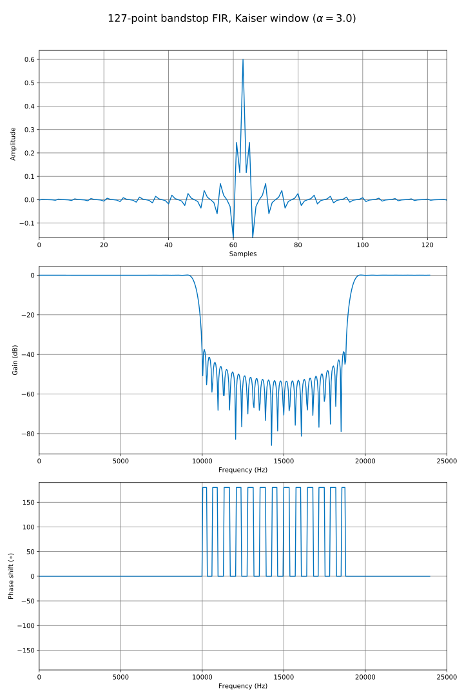
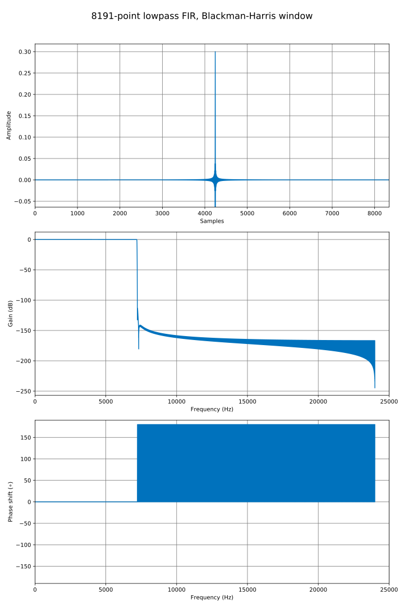
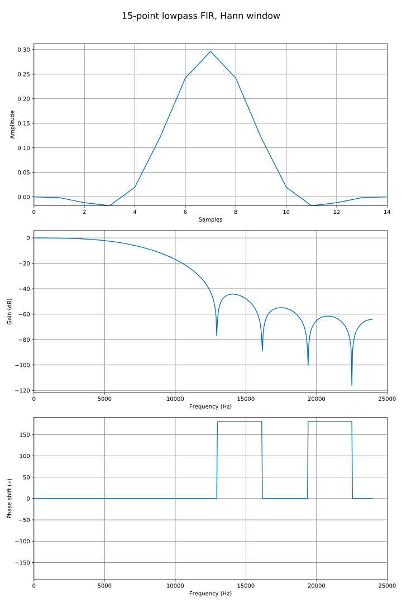
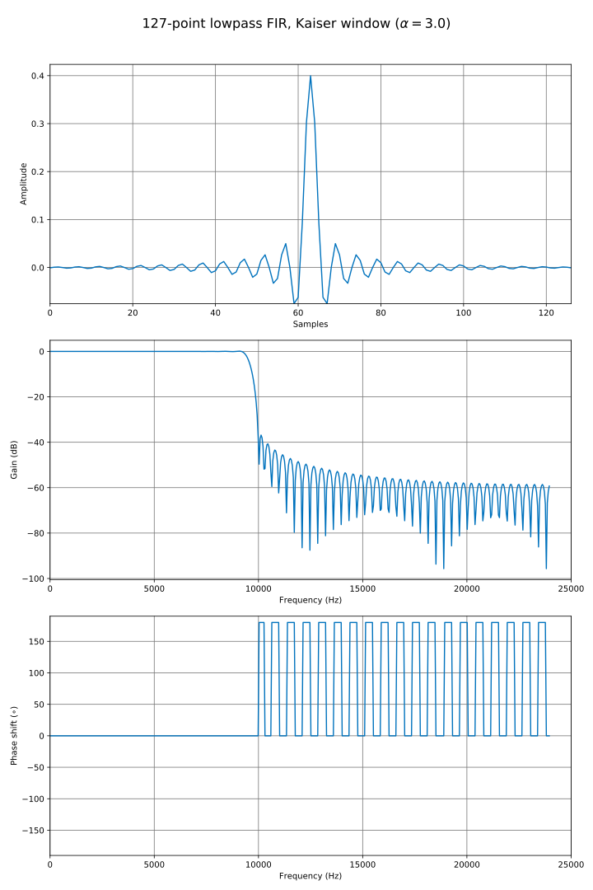
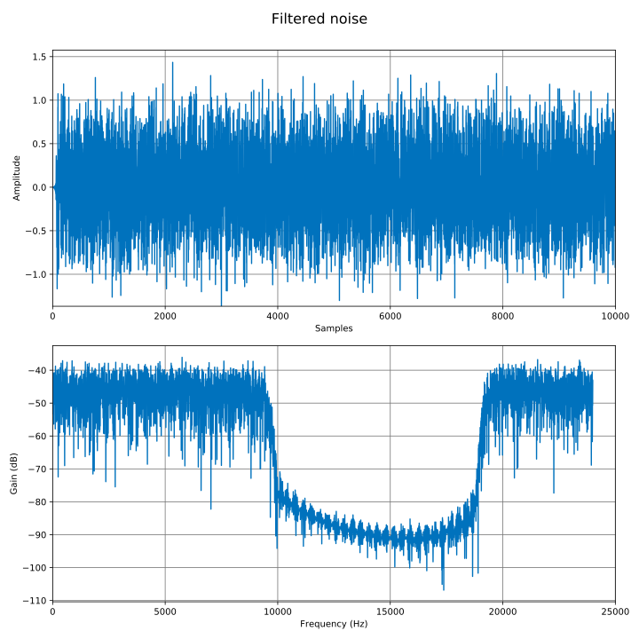

# FIR filters code & examples

## Bandpass, 127, Kaiser 

Code
```c++ linenums="1"
univector<fbase, 127> taps127;
expression_handle<fbase> kaiser = to_handle(window_kaiser(taps127.size(), 3.0));

// Fill taps127 with the band pass FIR filter coefficients using kaiser window and cutoff=0.2 and 0.4
fir_bandpass(taps127, 0.2, 0.4, kaiser, true);
// Plot filter, frequency and impulse response
plot_save("fir_bandpass_kaiser", taps127,
            options + ", phasearg='auto', title=r'127-point bandpass FIR, Kaiser window ($\\alpha=3.0$)'");
```
Result


## Bandstop, 127, Kaiser

Code
```c++ linenums="1"
univector<fbase, 127> taps127;
expression_handle<fbase> kaiser = to_handle(window_kaiser(taps127.size(), 3.0));

// Fill taps127 with the band stop FIR filter coefficients using kaiser window and cutoff=0.2 and 0.4
fir_bandstop(taps127, 0.2, 0.4, kaiser, true);
// Show filter, frequency and impulse response
plot_save("fir_bandstop_kaiser", taps127,
            options + ", phasearg='auto', title=r'127-point bandstop FIR, Kaiser window ($\\alpha=3.0$)'");
```
Result



## Highpass, 127, Kaiser

Code
```c++ linenums="1"
univector<fbase, 127> taps127;
expression_handle<fbase> kaiser = to_handle(window_kaiser(taps127.size(), 3.0));

// Fill taps127 with the high pass FIR filter coefficients using kaiser window and cutoff=0.2
fir_highpass(taps127, 0.2, kaiser, true);
// Plot filter, frequency and impulse response
plot_save("fir_highpass_kaiser", taps127,
            options + ", phasearg='auto', title=r'127-point highpass FIR, Kaiser window ($\\alpha=3.0$)'");
```
Result


## Lowpass, 8192, Blackman-Harris

Code
```c++ linenums="1"
univector<fbase, 8191> taps8191;
expression_handle<fbase> blackman_harris = to_handle(window_blackman_harris(taps8191.size()));

// Fill taps8191 with the low pass FIR filter coefficients using blackman harris window and cutoff=0.15
fir_lowpass(taps8191, 0.15, blackman_harris, true);

// Plot filter, frequency and impulse response, pass phasearg to get correct phase shift (phasearg=offset
// to unit impulse in samples)
plot_save(
    "fir_lowpass_blackman", taps8191,
    options +
        ", title='8191-point lowpass FIR, Blackman-Harris window', padwidth=16384");
```
Result



## Lowpass, 15, Hann

Code
```c++ linenums="1"
univector<fbase, 15> taps15;
expression_handle<fbase> hann = to_handle(window_hann(taps15.size()));

// Fill taps15 with the low pass FIR filter coefficients using hann window and cutoff=0.15
fir_lowpass(taps15, 0.15, hann, true);
// Plot filter, frequency and impulse response
// plot_save calls python (matplotlib and numpy must be installed) and saves SVG file
plot_save("fir_lowpass_hann", taps15,
            options + ", phasearg='auto', title='15-point lowpass FIR, Hann window'");
```
Result


## Lowpass, 127, Kaiser

Code

```c++ linenums="1"
univector<fbase, 127> taps127;
expression_handle<fbase> kaiser = to_handle(window_kaiser(taps127.size(), 3.0));

// Fill taps127 with the low pass FIR filter coefficients using kaiser window and cutoff=0.2
fir_lowpass(taps127, 0.2, kaiser, true);
// Plot filter, frequency and impulse response
plot_save("fir_lowpass_kaiser", taps127,
            options + ", phasearg='auto', title=r'127-point lowpass FIR, Kaiser window ($\\alpha=3.0$)'");
```
Result


## Bandstop, 127, Kaiser (using `filter_fir<>`)

```c++ linenums="1"
univector<fbase, 127> taps127;
expression_handle<fbase> kaiser = to_handle(window_kaiser(taps127.size(), 3.0));
fir_bandstop(taps127, 0.2, 0.4, kaiser, true);
// Initialize FIR filter with float input/output and fbase taps
filter_fir<fbase, float> fir_filter(taps127);

// Apply to univector, static array, data by pointer or anything
univector<float> filtered_noise;
fir_filter.apply(filtered_noise2, noise);

// Plot results
plot_save("filtered_noise", filtered_noise, "title='Filtered noise', div_by_N=True");
```

Result


## Bandpass, 127, Kaiser (using `filter_fir<>`)

```c++ linenums="1"
univector<fbase, 127> taps127;
expression_handle<fbase> kaiser = to_handle(window_kaiser(taps127.size(), 3.0));
fir_bandpass(taps127, 0.2, 0.4, kaiser, true);
// Initialize FIR filter with float input/output and fbase taps
filter_fir<fbase, float> fir_filter(taps127);

// Apply to univector, static array, data by pointer or anything
univector<float> filtered_noise2;
fir_filter.apply(filtered_noise2, noise);

// Plot results
plot_save("filtered_noise2", filtered_noise2, "title='Filtered noise 2', div_by_N=True");
```

Result

